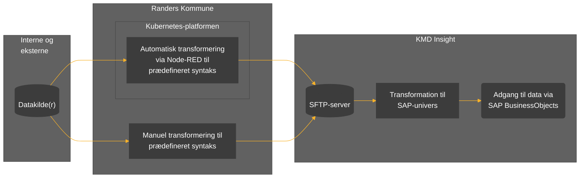
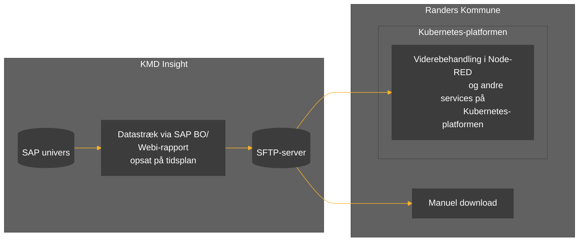

# Formål
Formålet med dette projekt er at lave en generisk ETL-service (_extract_, _transform_ og _load_) til up- og download af data til og fra Randers Kommunes KMD Insight løsning.

Løsningen skal udvikles i løbet af efteråret 2023.

## Komponenter
ETL-servicen bygger på en række komponenter:

* Eksterne datakilder som enten er håndholdte eller tilgængelige via et API.
* En Node-RED-datafordeler hosted på Randers Kommunes Kubernets-platform.
* En SFTP-server som en del af KMD Insight Custom Data.     
* SAP BusinessObjects (SAP BO). 

I tillæg til ETL-servicen, er det også muligt at manuelt at tilføje og hente data. Hvordan denne mulighed skal administreres skal afdækkes i BI-teamet. 

# Upload 
Uploadflowet er illustreret i nedenstående figur: 

## Transformation
For data kan transformeres til et SAP univers, skal det afleveres i en bestemt struktur på SFTP-serveren. Her kan i udgangspunktet vælges mellem to muligheder: 
1. Metadata og data samlet i en fil
2. Opdelt metadata og data i to separate filer

Fordelen ved mulighed  er, at metadata kan genbruges. I begge tilfælde skal data afleveres som UTF8-kodede csv-filer på SFTP-serveren. Der henvises til [/docs](/docs/KMD%20Insight%20Custom%20Data%20Dokumentation.pdf) for yderligere dokumentation. 

# Download
Download af data forudsætter en Webi-rapport opsat på en tidsplan, som afleverer data via en tidsplan til SFTP-serveren. 

Downloadflowet er illustreret i nedenstående figur: 

# Testdata
I forbindelse med udviklingen anvendes [FOLKA1](https://www.statistikbanken.dk/20021) tilgængelig fra [api.statbank.dk](https://api.statbank.dk).

