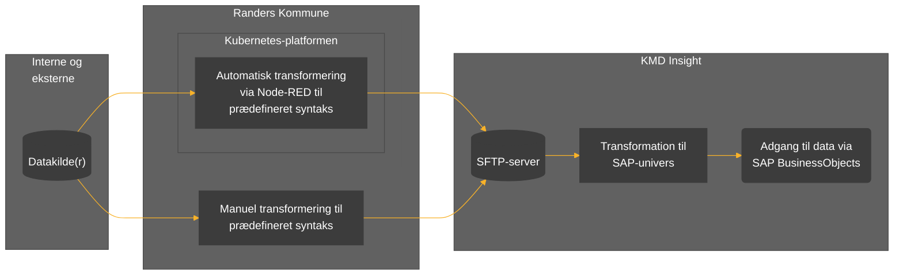
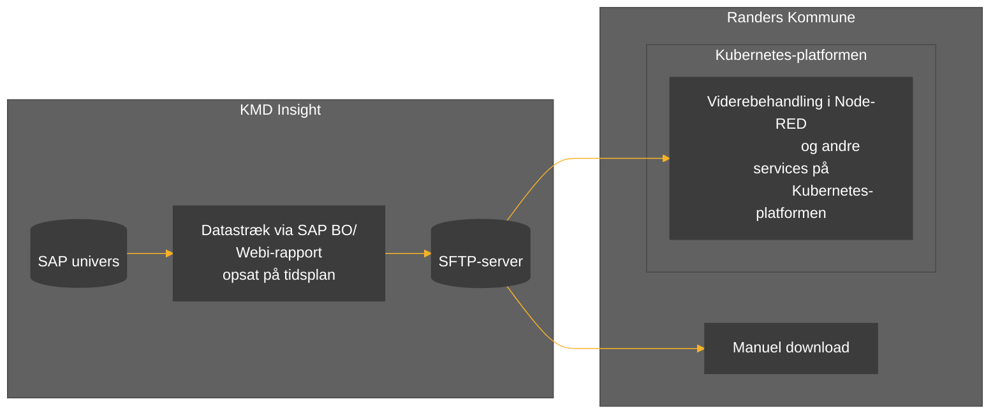

# Formål
Formålet med dette projekt er at lave en generisk ETL-service (_extract_, _transform_ og _load_) til up- og download af data til og fra Randers Kommunes KMD Insight løsning.

Løsningen skal udvikles i løbet af efteråret 2023.

## Komponenter
ETL-servicen bygger på en række komponenter:

* Eksterne datakilder som enten er håndholdte eller tilgængelige via et API.
* En Node-RED-datafordeler hosted på Randers Kommunes Kubernets-platform.
* En SFTP-server som en del af KMD Insight Custom Data.     
* SAP BusinessObjects (SAP BO). 

I tillæg til ETL-servicen, er det også muligt at manuelt at tilføje og hente data. Hvordan denne mulighed skal administreres skal afdækkes i BI-teamet. 

# Upload 
Uploadflowet er illustreret i nedenstående figur: 

## Transformation
For data kan transformeres til et SAP univers, skal det afleveres i en bestemt struktur på SFTP-serveren. Her kan i udgangspunktet vælges mellem to muligheder: 
1. Metadata og data samlet i en fil
2. Opdelt metadata og data i to separate filer

Fordelen ved mulighed  er, at metadata kan genbruges. I begge tilfælde skal data afleveres som UTF8-kodede csv-filer på SFTP-serveren. Der henvises til [/docs](/docs/KMD%20Insight%20Custom%20Data%20Dokumentation.pdf) for yderligere dokumentation. 

# Download
Download af data forudsætter en Webi-rapport opsat på en tidsplan, som afleverer data via en tidsplan til SFTP-serveren. 

Downloadflowet er illustreret i nedenstående figur: 



# Testdata
I forbindelse med udviklingen anvendes [FOLKA1](https://www.statistikbanken.dk/20021) tilgængelig fra [api.statbank.dk](https://api.statbank.dk).

# REST API Documentation

#### Creating/overwriting meta and data files

<details>
 <summary><code>POST</code> <code><b>/in</b></code> <code>(create with JSON)</code></summary>

#### Notes
> The generated files will be named in the forms: Data\_\<group\>_\<name\>.csv and Meta\_\<group\>.csv \
> If the key "name" is omitted, both the data and meta file will have the same name. E.g. "Meta_myGroup.csv" and "Data_myGroup.csv"

#### Custom headers (optional)
> | name      |  type                   | description                                                                                                |
> |-----------|------------------------------------|-------------------------------------------------------------------------------------------------|
> | new-meta  |  string | "true" - force to generate new meta file |
> | overwrite  |  string | "true" - overwrites files if they already exitsts |
> | auth      |  comma seperated string | list of org. units (ØK,IT,SKO etc.) - only allow group with org. unit prefix. If admin then any group value is allowed|

#### Parameters

> | name      |  type     | data type               | description                                                           |
> |-----------|-----------|-----------------------------------|-----------------------------------------------------------------------|
> | body      |  required | JSON object  | N/A  |

###### Example JSON object

```json
{
    "group":"myGroup",
    "name": "myName", (optional)
    "data":[
        {
            "myColNum": 1,
            "myColText":"some text"
        },
        {
            "myColNum": 2,
            "myColText":"some more text"
        }
    ]
}
```

#### Responses

> | http code     | content-type                      | response                                                            |
> |---------------|-----------------------------------|---------------------------------------------------------------------|
> | `200`         | `application/json`                | `{"success":true,"message":"<N> fil(er) uploaded", "files":[<filenames>]}`|
> | `400/401/500` | `application/json`                | `{"success":false,"message":"<error message>"}`|
</details>

<details>
 <summary><code>POST</code> <code><b>/in</b></code> <code>(create with formData - one or more CSV files)</code></summary>

#### Notes
> _**Important!**_ filenames must be percent-encoded (URL encoded) to handle special characters such as æ,ø,å. [Javascipt function](https://developer.mozilla.org/en-US/docs/Web/JavaScript/Reference/Global_Objects/encodeURI)

#### Custom headers (optional)
> | name      |  type                   | description                                                                                                |
> |-----------|------------------------------------|-------------------------------------------------------------------------------------------------|
> | overwrite  |  string | "true" - overwrites files if they already exitsts |
> | new-meta  |  string | true/false - force to generate new meta file |
> | auth      |  comma seperated string | list of org. units (ØK,IT,SKO etc.) - only allow group with org. unit prefix. If admin then any group value is allowed|

#### Parameters

> | name      |  type     | data type               | description                                                           |
> |-----------|-----------|-----------------------------------|-----------------------------------------------------------------------|
> | body      |  required |  formData  | formData with one or more field(s) containing CSV files , field names ignored |

#### Responses

> | http code     | content-type                      | response                                                            |
> |---------------|-----------------------------------|---------------------------------------------------------------------|
> | `200`         | `application/json`                | `{"success":true,"message":"<N> fil(er) uploaded", "files":[<filenames>]}`|
> | `400/401/500` | `application/json`                | `{"success":false,"message":"<error message>"}`|
</details>

<details>
 <summary><code>POST</code> <code><b>/in/{filename}</b></code> <code>(create with CSV file)</code></summary>

 #### Notes
> Filenames must follow the form \<Group\>_\<name\>.csv or \<Group\>.csv \
> The generated files will be: Data\_\<group\>_\<name\>.csv (or Data\_\<group\>.csv if original filename did not have any underscores) and Meta\_\<group\>.csv

#### Custom headers (optional)
> | name      |  type                   | description                                                                                                |
> |-----------|------------------------------------|-------------------------------------------------------------------------------------------------|
> | overwrite  |  string | "true" - overwrites files if they already exitsts |
> | new-meta  |  string | true/false - force to generate new meta file |
> | auth      |  comma seperated string | list of org. units (ØK,IT,SKO etc.) - only allow group with org. unit prefix. If admin then any group value is allowed|

#### Parameters

> | name      |  type     | data type               | description                                                           |
> |-----------|-----------|-----------------------------------|-----------------------------------------------------------------------|
> | filename |  required |   string    | the filename e.g. My_file.csv |
> | body      |  required |   text/csv  | a CSV string with data in the form described in KMD Insight documentation|

#### Responses

> | http code     | content-type                      | response                                                            |
> |---------------|-----------------------------------|---------------------------------------------------------------------|
> | `200`         | `application/json`                | `{"success":true,"message":"<N> fil(er) uploaded", "files":[<filenames>]}`|
> | `400/401/500` | `application/json`                | `{"success":false,"message":"<error message>"}`|
</details>

<details>
 <summary><code>PUT</code> <code><b>/in</b></code> <code>(create or overwite files)</code></summary>

#### Custom headers (optional)
> | name      |  type                   | description                                                                                                |
> |-----------|------------------------------------|-------------------------------------------------------------------------------------------------|
> | new-meta  |  string | true/false - force to generate new meta file |
> | auth      |  comma seperated string | list of org. units (ØK,IT,SKO etc.) - only allow group with org. unit prefix. If admin then any group value is allowed|

#### Parameters

> | name      |  type     | data type               | description                                                           |
> |-----------|-----------|-----------------------------------|-----------------------------------------------------------------------|
> | body      |  required | JSON object  | N/A  |

###### Example JSON object

```json
{
    "group":"myGroup",
    "name": "myName", (optional)
    "data":[
        {
            "myColNum": 1,
            "myColText":"some text"
        },
        {
            "myColNum": 2,
            "myColText":"some more text"
        }
    ]
}
```

#### Responses

> | http code     | content-type                      | response                                                            |
> |---------------|-----------------------------------|---------------------------------------------------------------------|
> | `200`         | `application/json`                | `{"success":true,"message":"<N> fil(er) uploaded", "files":[<filenames>]}`|
> | `400/401/500` | `application/json`                | `{"success":false,"message":"<error message>"}`|
</details>

<details>
 <summary><code>PUT</code> <code><b>/in/{filename}</b></code> <code>(create or overwite files)</code></summary>

#### Custom headers (optional)
> | name      |  type                   | description                                                                                                |
> |-----------|------------------------------------|-------------------------------------------------------------------------------------------------|
> | new-meta  |  string | true/false - force to generate new meta file |
> | auth      |  comma seperated string | list of org. units (ØK,IT,SKO etc.) - only allow group with org. unit prefix. If admin then any group value is allowed|

#### Parameters

> | name      |  type     | data type               | description                                                           |
> |-----------|-----------|-----------------------------------|-----------------------------------------------------------------------|
> | filename |  required |   string    | must start with 'Meta_' or 'Data_', e.g. Meta_my_file.csv |
> | body      |  required |   text/csv  | a CSV string with data in the form described in KMD Insight documentation|


#### Responses

> | http code     | content-type                      | response                                                            |
> |---------------|-----------------------------------|---------------------------------------------------------------------|
> | `200`         | `application/json`                | `{"success":true,"message":"<N> fil(er) uploaded", "files":[<filenames>]}`|
> | `400/401/500` | `application/json`                | `{"success":false,"message":"<error message>"}`|
</details>

#### Getting meta and data files

<details>
 <summary><code>GET</code> <code><b>/in</b></code> <code>(get list of files)</code></summary>

#### Custom headers (optional)
> | name      |  type                   | description                                                                                                |
> |-----------|------------------------------------|-------------------------------------------------------------------------------------------------|
> | auth      |  comma seperated string | list of org. units (ØK,IT,SKO etc.) allowed to be returned, if it contains 'admin' all files are returned. |

##### Parameters

> None


#### Responses

> | http code     | content-type                      | response                                                            |
> |---------------|-----------------------------------|---------------------------------------------------------------------|
> | `200`         | `application/json`                | `{"success":true,"files":{"failed":[<filenames>],"imported":[<filenames>],"waiting":[<filenames>]}}`|
> | `400/401/500` | `application/json`                | `{"success":false,"message":"<error message>"}`|
</details>


<details>
 <summary><code>GET</code> <code><b>/in/{filename}</b></code> <code>(get file)</code></summary>

#### Custom headers (optional)
> | name      |  type                   | description                                                                                                |
> |-----------|------------------------------------|-------------------------------------------------------------------------------------------------|
> | auth      |  comma seperated string | list of org. units (ØK,IT,SKO etc.) allowed to be returned, if it contains 'admin' all files are allowed. |

#### Parameters

> | name      |  type     | data type               | description                                                           |
> |-----------|-----------|-----------------------------------|-----------------------------------------------------------------------|
> | filename |  required |   string                | must match an existing filename exacly e.g. Data_my_file.csv |


#### Responses

> | http code     | content-type                      | response                                                            |
> |---------------|-----------------------------------|---------------------------------------------------------------------|
> | `200`         | `text/csv`                        | CSV string                                     |
> | `400/401/500` | `application/json`                | `{"success":false,"message":"<error message>"}`|
</details>

#### Getting and deleting files exported from KMD insight

<details>
 <summary><code>GET</code> <code><b>/out</b></code> <code>(get list of files)</code></summary>

#### Custom headers (optional)
> | name      |  type                   | description                                                                                                |
> |-----------|------------------------------------|-------------------------------------------------------------------------------------------------|
> | auth      |  comma seperated string | only allowed if contains admin. |

##### Parameters

> None


#### Responses

> | http code     | content-type                      | response                                                            |
> |---------------|-----------------------------------|---------------------------------------------------------------------|
> | `200`         | `application/json`                | `{"success":true,"files":[<filenames>]}`|
> | `400/401/500` | `application/json`                | `{"success":false,"message":"<error message>"}`|
</details>


<details>
 <summary><code>GET</code> <code><b>/out/{filename}</b></code> <code>(get file)</code></summary>

#### Custom headers (optional)
> | name      |  type                   | description                                                                                                |
> |-----------|------------------------------------|-------------------------------------------------------------------------------------------------|
> | auth      |  comma seperated string | only allowed if contains admin. |

#### Parameters

> | name      |  type     | data type               | description                                                           |
> |-----------|-----------|-----------------------------------|-----------------------------------------------------------------------|
> | filename |  required |   string                | must match an existing filename exacly e.g. my_out_file.xlsx |


#### Responses

> | http code     | content-type                      | response                                                            |
> |---------------|-----------------------------------|---------------------------------------------------------------------|
> | `200`         | binary                   | binary file                                  |
> | `400/401/500` | `application/json`                | `{"success":false,"message":"<error message>"}`|
</details>

<details>
 <summary><code>DELETE</code> <code><b>/out/{filename}</b></code> <code>(get file)</code></summary>

#### Custom headers (optional)
> | name      |  type                   | description                                                                                                |
> |-----------|------------------------------------|-------------------------------------------------------------------------------------------------|
> | auth      |  comma seperated string | only allowed if contains admin. |

#### Parameters

> | name      |  type     | data type               | description                                                           |
> |-----------|-----------|-----------------------------------|-----------------------------------------------------------------------|
> | filename |  required |   string                | must match an existing filename exacly e.g. my_out_file.xlsx |


#### Responses

> | http code     | content-type                      | response                                                            |
> |---------------|-----------------------------------|---------------------------------------------------------------------|
> | `200`         | binary                   | binary file                                  |
> | `400/401/500` | `application/json`                | `{"success":false,"message":"<error message>"}`|
</details>

#### Undocumented endpoints
<summary><code>DELETE</code> <code><b>/in/{filename}</b></code> <code>(delete a file which has failed to be imported into KMD Insight)</code></summary>
<summary><code>POST</code> <code><b>/in/aut</b></code> <code>(create authentication file (Aut_&ltfilename>.csv))</code></summary>
<summary><code>POST</code> <code><b>/in/aut/{filename}</b></code> <code>(create authentication file (Aut_&ltfilename\>.csv))</code></summary>
<summary><code>PUT</code> <code><b>/in/aut/{filename}</b></code> <code>(create/overwrite authentication file (Aut_&ltfilename\>.csv))</code></summary>